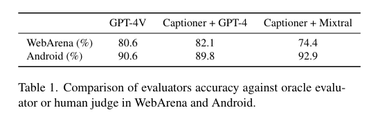

# Autonomous Evaluation and Refinement of Digital Agents (2024)

[Arxiv](https://arxiv.org/abs/2404.06474)

## Summary

This paper outlines methods for using general (non-domain specific) evaluation models to improve the performance of an agent without human feedback or "oracle" evaluation metrics.
This can be used:

- To filter trajectories sampled from an agent when building a training set (filtered behaviour cloning).
- To guide an existing agent at inference time (Reflexion).

## Details

### Domain-General Evaluators

Given a user instruction $x$ (e.g. `Check the weather`) and an initial environment state $s_0$ (a screenshot), an agent generates a sequence of actions $\boldsymbol{a} = (a_0, a_1, \ldots, a_n)$, resulting in a set of states $\boldsymbol{s} = (s_0, s_1, \ldots, s_{n+1})$. Actions are also text, e.g. `<Type: "Hello">`.

Given $x$, $\boldsymbol{s}$ and $\boldsymbol{a}$, the model (evaluator) returns a set of scalar "evaluations" (scores/rewards), one for each step of the sequence.

$$
\boldsymbol{r} = \text{evaluate}(x, \boldsymbol{a}, \boldsymbol{s})
$$

These can be:

- Trajectory level - Queried once. 0 for every step where the task is not complete and 1 for the first step where the task is completed.
- Per-step - Queried on every step. Each step is classified as success ($r_i = 1$ for success at action $i$), progress towards goal ($r_i = p \geq 0 $) or not contributing to objective ($r_i = d < 0$).

The paper suggests two approaches to building these evaluators:

- Use powerful models like GPT-4V that takes screenshots and returns an evaluation (more expensive, stronger performing, black-box).
- Use a less powerful VLM to describe what is happening in a screenshot, then use an LM to evaluate from the description. (Cheaper, lower performing, more explainable).

### Caption-then-Reason

One of the interesting approaches used in this paper is to use a VLM to describe the screenshot, then use a text-only model to produce the evaluation.
This works well when the description is suitably detailed, which is apparently easy with proprietary models/GPT-4V but hard with open-source models.
The authors fine-tuned an open model on a small dataset of screenshots + GPT-4V generated descriptions (cleaned manually), to improve the performance.
They also provide the text from the screenshot in the VLM prompt to reduce hallucination, using `EasyOCR` to generate this.

### Experiments

Three evaluation models:

- GPT-4V end-to-end
- Captioner (fine-tuned QWen-XL) + Mixtral reasoner
- Captioner (fine-tuned QWen-XL) + GPT-4 reasoner

These were tested on the WebArena and Android-in-the-Wild tasks.

