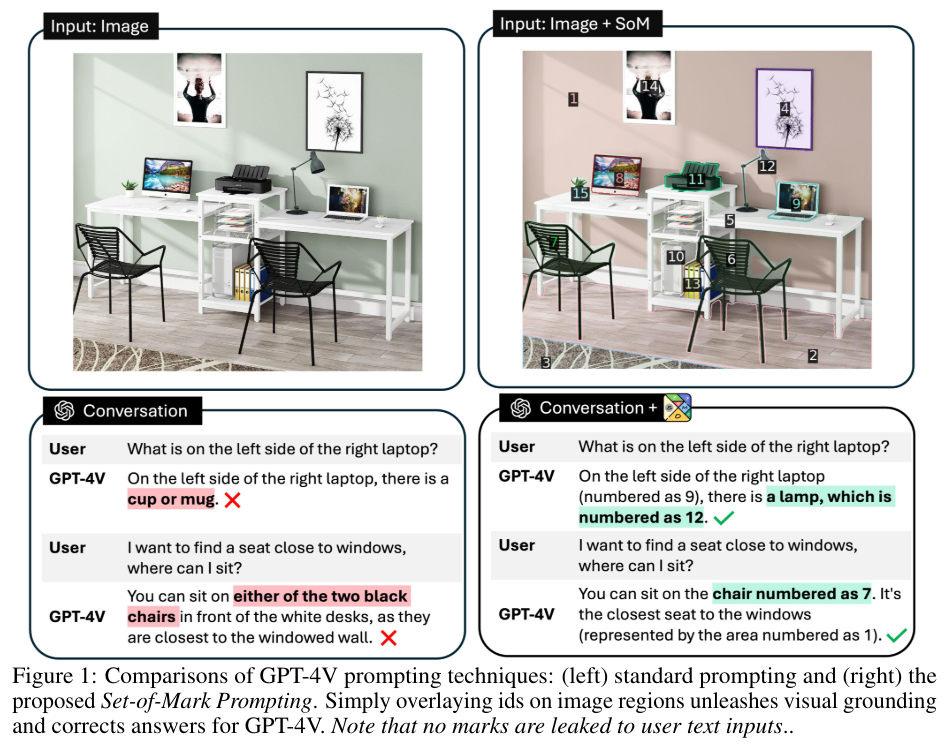
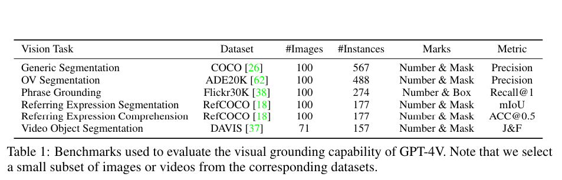
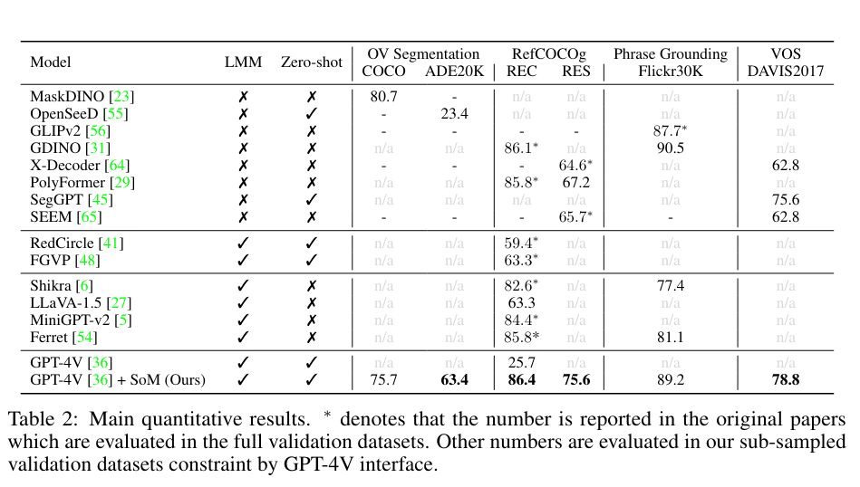

# Set-of-Mark Prompting (2023)

[Arxiv](https://arxiv.org/abs/2310.11441)

## Summary

This paper proposes a method for visually prompting VLMs using image segmentation to partition the prompt image and a set of marks (masks, boxes, alphanumerics etc) to further identify them.

## Details

### Problem

GPT-4V's fine-grained visual grounding ability is relatively weak, for example struggling to output accurate coordinates for image elements.
This paper aims to improve the performance of GPT-4V (and other VLMs) by improving the visual inputs such that they are easier for the model to interpret.
Previously, people have overlaid visual marks such as arrows or boxes or encoded these pointers as separate features.
These are difficult for LLMs to "speak" about, which limits the grounding capability.

#### Set-of-Mark

The paper proposes set-of-mark prompting:

- Segment the image into meaninfully different regions using an image segmentation model.
- Overlay each region with a mark of various formats (numbers, alphabets, masks, boxes).
  - Marks should be image dependent, for example not using numbers in an image full of numbers.
  - Allocating mark position is done with an allocation algorithm to avoid conflict.
    - Generally this trys to allocate marks to points that don't overlap with others.
    - For screen elements I don't think this is massively important - controls need to be distinct to be used.
    - They use black boxes with numbers on top to label.

### Experiments

The paper uses 4 different tasks to evaluate prompting:

- Open-vocabulary segmentation - Name the marked regions.
- Referring segmentation - Tell me the ids for certain objects.
- Video object segmentation - 2 images from the same video, match objects by id between the two.
- Grounded segmentation - Map a description to an object.

